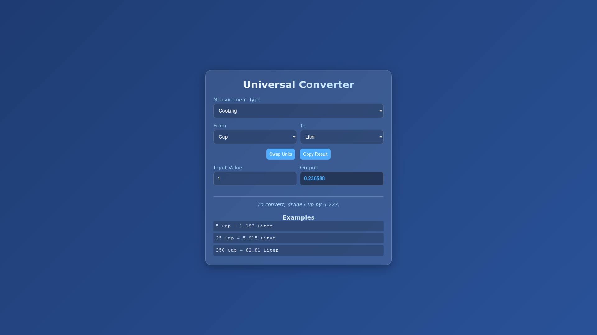

# UnitConvert
A single-page web application that provides a universal unit converter. It is built entirely with HTML, CSS, and JavaScript.

## Features

*   **Multiple Categories:** Supports a wide range of measurement categories, including:
    *   Length
    *   Angle
    *   Force
    *   Torque
    *   Area
    *   Mass
    *   Volume
    *   Speed
    *   Temperature
    *   Energy
    *   Power
    *   Pressure
    *   Digital Storage
    *   Time
    *   Fuel Economy
    *   Cooking
*   **Real-time Conversion:** The converted value is updated automatically as you type.
*   **Swap Units:** Easily swap the "From" and "To" units with a single click.
*   **Copy to Clipboard:** Copy the result to your clipboard.
*   **Conversion Details:** Displays the formula used for the conversion and provides examples.
*   **Modern UI:** A clean and modern user interface with a gradient background.

## How to Use

1.  Open the `unitconvert.html` file in your web browser.
2.  Select a measurement category from the dropdown menu.
3.  Select the "From" and "To" units.
4.  Enter the value you want to convert in the "Input Value" field.
5.  The converted value will be displayed in the "Output" field.

## Technologies Used

*   HTML
*   CSS
*   JavaScript

## Development

All the code for this project is located in the `unitconvert.html` file.

*   **HTML:** The structure of the application is defined in the `<body>` of the HTML.
*   **CSS:** The styles are embedded within the `<style>` tags in the `<head>` of the HTML.
*   **JavaScript:** The conversion logic and UI interactions are handled by the JavaScript code within the `<script>` tags at the end of the `<body>`.

